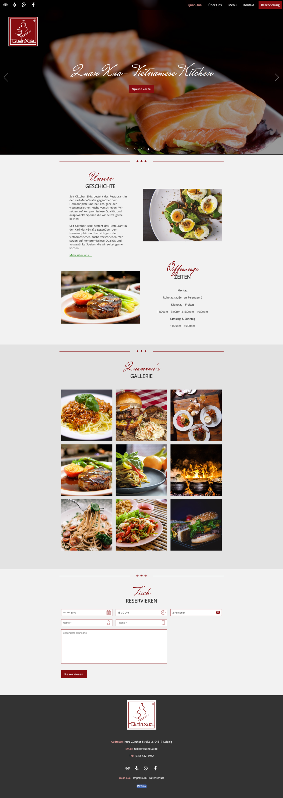

# Quanxua Restaurant (Frontend part)

`html` `css (scss)` `javascript (jQuery)` `gulp`

by [Thaison Dang](https://github.com/thaisonbk57)

# Features

- clients can make a reservation with the form. (backend with expressJS and nodemailer)
- excelent responsive design for all devices.
- clients can contact the restaurant with a form.
- facebook share feature.
- lazyload image to speed up the page.

[LIVE](https://quanxua.de/)

